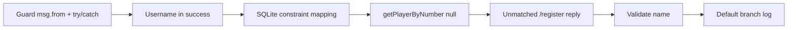

# Fix /register Command Flow

## Scope

Address the issues identified in the flow analysis. Work is confined to:

- [src/commands/player/register.js](src/commands/player/register.js) – command handlers
- [src/services/player-service.js](src/services/player-service.js) – validation and error mapping
- [src/api/players.js](src/api/players.js) – return contract for `getPlayerByNumber`
- [src/utils/messages.js](src/utils/messages.js) – only if we add a new message (e.g. "no from")

## Implementation order

1. **Guard `msg.from` and add try/catch** – Prevents crashes and unhandled rejections; all other fixes assume the handler runs safely.
2. **Username in success message** – Quick fix in the command; no new error codes.
3. **Map SQLite constraint errors** – Service returns `NUMBER_IN_USE` / `ALREADY_REGISTERED` when `createPlayer` fails with UNIQUE, so users get the right message under race.
4. `**getPlayerByNumber` return `null` – API contract clarity; used by service.
5. **Reply for unmatched `/register ...`** – New handler so `/register 10 Nghia` gets instruction (and optionally align messages with “only NUMBER”).
6. **Validate non-empty name** – New validation in service + map to existing `REGISTER.invalidName`.
7. **Default branch logging** – Log `result.error ?? result` in the default case.

Optional (not in tasks): consistent success shape (`result.data.player` everywhere); max jersey number (e.g. 1–99) if product wants it.

---

## Task 1: Guard `msg.from` and wrap handler in try/catch

**File:** [src/commands/player/register.js](src/commands/player/register.js)

- In the handler for `/^\/register (\d+)$/`:
  - At the top, if `!msg?.from`, send a single reply (e.g. use a new message key like `REGISTER.needPrivateChat` or reuse a generic “Cannot identify user”) then `return`.
  - Wrap the rest of the async handler body in `try/catch`. On `catch (err)`: log `err`, send `REGISTER.error` via `sendMessage`, then `return`.

**File:** [src/utils/messages.js](src/utils/messages.js) (if new message)

- Add something like `needPrivateChat: '⚠️ Lệnh này cần được gửi từ tài khoản cá nhân (có thông tin người gửi).'` under `REGISTER` if we introduce a dedicated message; otherwise reuse an existing generic message.

---

## Task 2: Normalize username in success message

**File:** [src/commands/player/register.js](src/commands/player/register.js)

- In the success branch, when building the message:
  - Replace `.replace('${username}', player.username)` with `.replace('${username}', player.username ?? '—' hoặc 'Chưa có')` (or a constant from `REGISTER` like `noUsername: 'Chưa có'` used here) so the user never sees the string `"null"`.

---

## Task 3: Map SQLite UNIQUE errors to NUMBER_IN_USE / ALREADY_REGISTERED

**File:** [src/services/player-service.js](src/services/player-service.js)

- Inside the `catch` of `createPlayer`:
  - If `error.code === 'SQLITE_CONSTRAINT'` (or equivalent from the sqlite3 package), inspect `error.message` (e.g. “UNIQUE constraint failed: players.number” vs “players.user_id”).
  - If constraint on `number`: call `getPlayerByNumber(number)`, then return `{ ok: false, code: 'NUMBER_IN_USE', data: { player: existing } }` (same shape as current NUMBER_IN_USE).
  - If constraint on `user_id`: call `getPlayerByUserId(userId)`, then return `{ ok: false, code: 'ALREADY_REGISTERED', data: { player: existing } }`.
  - Otherwise rethrow or return `{ ok: false, code: 'UNEXPECTED_ERROR', error }` as today.

No change to [src/commands/player/register.js](src/commands/player/register.js) for this task; it already handles these codes.

---

## Task 4: getPlayerByNumber returns null when no row

**File:** [src/api/players.js](src/api/players.js)

- In `getPlayerByNumber`, change `resolve(row)` to `resolve(row ?? null)` so the function always returns `Object | null`, never `undefined`. Update JSDoc to state return type `Promise<Object|null>`.

---

## Task 5: Reply when /register has extra or invalid args

**File:** [src/commands/player/register.js](src/commands/player/register.js)

- Register a third handler that runs only when the other two did not match. Use a pattern that matches any `/register` with more content (e.g. `/^\/register\s+.+$/`). In the handler, send `REGISTER.instruction` (same as `/register` alone) so the user sees the correct usage. Ensure this handler is registered after `/^\/register (\d+)$/` so “/register 10” is still handled by the numeric handler (order of registration matters for `onText`).

**File:** [src/utils/messages.js](src/utils/messages.js)

- Optionally update `REGISTER.instruction` to say only one argument (NUMBER) and remove references to “NAME” and “/register 10 Nghia” so copy matches behavior.

---

## Task 6: Validate non-empty name (first_name)

**File:** [src/services/player-service.js](src/services/player-service.js)

- After deriving `name = teleUser.first_name`, add: if `name == null || String(name).trim() === ''`, return `{ ok: false, code: 'INVALID_NAME', data: {} }` (or reuse a code; command will map to invalidName).

**File:** [src/commands/player/register.js](src/commands/player/register.js)

- In the switch on `result.code`, add a case `'INVALID_NAME'`: send `REGISTER.invalidName` (already exists in [src/utils/messages.js](src/utils/messages.js)).

---

## Task 7: Safer logging in default error branch

**File:** [src/commands/player/register.js](src/commands/player/register.js)

- In the `default` branch of the error switch, change `console.error('Error registering player:', result.error);` to `console.error('Error registering player:', result.error ?? result);` so unknown shapes still log useful data.

---

## Testing

- **Existing:** [tests/services/player-service.test.js](tests/services/player-service.test.js) – already has `INVALID_NUMBER` test.
- **Add (recommended):**
  - Service: `registerPlayer` with empty/whitespace `first_name` returns `INVALID_NAME`.
  - Service: when `createPlayer` rejects with a UNIQUE constraint on `number`, return `NUMBER_IN_USE` with `data.player` (mock or integration with in-memory SQLite).
- **Manual:** Run bot and try `/register`, `/register 10`, `/register 10 Nghia`, `/register 0`, and double-register same number concurrently.

---

## Summary of file touches

| File                                                                           | Tasks                                             |
| ------------------------------------------------------------------------------ | ------------------------------------------------- |
| [src/commands/player/register.js](src/commands/player/register.js)             | 1, 2, 5, 6, 7                                     |
| [src/services/player-service.js](src/services/player-service.js)               | 3, 6                                              |
| [src/api/players.js](src/api/players.js)                                       | 4                                                 |
| [src/utils/messages.js](src/utils/messages.js)                                 | 1 (optional), 5 (optional)                        |
| [tests/services/player-service.test.js](tests/services/player-service.test.js) | Add tests for INVALID_NAME and constraint mapping |
