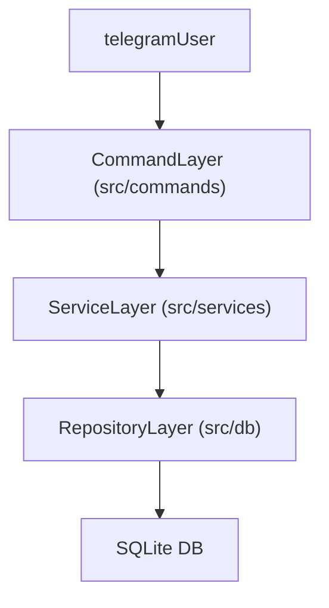

# Refactor to CRUD/API Layer Between Commands and SQL

## Goals

- Decouple command handlers from direct database/SQL access.
- Centralize persistence and business logic in well-defined services and repositories.
- Preserve existing bot behavior and command responses.

## Target Architecture

- **Command layer (`src/commands/`**)**
  - Parses `/command` text and arguments from Telegram updates.
  - Performs basic validation and permission checks.
  - Calls domain services with plain JS arguments.
  - Formats responses using `utils/messages` and `utils/chat.sendMessage`.
  - Does not import `sqlite3` or execute SQL.
- **Service/domain layer (`src/services/`**)**
  - Implements use-cases in domain terms (player registration, leaderboard updates, etc.).
  - Orchestrates repository calls and translates DB errors to domain errors.
  - Returns plain JS objects and structured error information to commands.
  - Knows nothing about Telegram-specific types (`msg`, `chatId`, threads).
- **Repository/CRUD layer (`src/db/`**)**
  - Encapsulates all direct SQL and `sqlite3` interaction.
  - Exposes CRUD-style functions for individual tables (`players`, `leaderboard`).
  - Contains no command-specific or Telegram-specific logic.

## Step 1: Stabilize and clarify repository layer

- **Review and adjust `players` repository**
  - File: `[src/db/players.js](src/db/players.js)`
  - Ensure exported functions are purely CRUD-style and table-focused:
    - `createPlayer({ userId, name, number, username })` (wrap existing `addPlayer`).
    - `findPlayerByUserId(userId)` (wrap `getPlayerByUserId`).
    - `findPlayerByNumber(number)` (wrap `getPlayerByNumber`).
    - `findAllPlayers()` (wrap `getAllPlayers`).
    - `updatePlayerRow(userId, patch)` (wrap `updatePlayer`).
    - `incrementPlayerStats(userId, goalsDelta, assistsDelta)` (wrap `updatePlayerStats`) if actually used.
    - `deletePlayerByUserId(userId)` (wrap `deletePlayer`).
    - `searchPlayersByNameOrUsername(term)` (wrap `searchPlayers`).
  - Remove or down-scope any user-facing validation strings from this layer; those belong in services/commands.
- **Review and adjust `leaderboard` repository**
  - File: `[src/db/leaderboard.js](src/db/leaderboard.js)`
  - Keep this as the single point of SQL for leaderboard operations:
    - `findLeaderboardOrdered()` (based on current `getLeaderboard`).
    - `upsertMatchResult(playerNumber, result)` or keep the existing batch SQL but expose it as repository functions.
    - `upsertTotals(playerNumber, totals)` (based on `updatePlayerStatsDirect`).
    - `findPlayerStats(playerNumber)` and `findManyPlayerStats(playerNumbers)` (wrapping `getPlayerStats` and `getMultiplePlayerStats`).
    - `incrementGoal(playerNumber, delta)` and `incrementAssist(playerNumber, delta)` (wrapping `updatePlayerGoal` / `updatePlayerAssist`).
  - Keep transaction handling here if it is purely about SQL grouping.
- **Clarify schema expectations**
  - Ensure the repository functions match the schema defined in `[src/script/tables.sql](src/script/tables.sql)`.
  - Document in comments where fields live (for example, goals/assists are on `leaderboard`, not `players`).

## Step 2: Introduce service layer modules

- **Create `PlayerService`**
  - File: `src/services/player-service.js`.
  - Responsibilities:
    - `registerPlayer({ teleUser, number })`
      - Validate `number` is a positive integer.
      - Check for existing player by `teleUser.id` via repository.
      - Optionally check uniqueness of `number` if required by business rules.
      - On success, call `createPlayer` and return a domain object:
      `{ teleId, name, number, username }`.
      - On failure, throw or return structured errors such as `ALREADY_REGISTERED` or `NUMBER_IN_USE` with contextual data.
    - `getPlayerByTelegramId(teleId)` using `findPlayerByUserId`.
    - Any higher-level operations currently implemented directly in commands that relate to player identity.
- **Create `LeaderboardService`**
  - File: `src/services/leaderboard-service.js`.
  - Responsibilities:
    - `getLeaderboardForDisplay()`
      - Calls `findLeaderboardOrdered()` and returns plain rows for commands.
    - `applyMatchResult({ result, playerNumbers })`
      - Validate `result` is one of `WIN`, `LOSE`, `DRAW`.
      - Validate and normalize `playerNumbers` list.
      - Delegate to a repository batch update function (or loop `upsertMatchResult`).
    - `updateGoal({ playerNumber, delta })` and `updateAssist({ playerNumber, delta })`
      - Validate inputs and delegate to `incrementGoal`/`incrementAssist`.
    - Potential helper methods for per-player stats retrieval used by `/player` command.
- **Error model for services**
  - Decide on one approach (and apply consistently):
    - Either throw custom error instances (`new PlayerAlreadyRegisteredError(...)`) and catch them in commands, or
    - Return `{ ok: false, code: 'ALREADY_REGISTERED', details }` from services.
  - Map these error codes to human-readable strings in `utils/messages.js`.

## Step 3: Refactor a small set of commands to use services

- **Refactor `/register` command first (simple path)**
  - File: `[src/commands/player/register.js](src/commands/player/register.js)`.
  - Replace direct imports from `db/players` with `PlayerService`:
    - Parse `/register (\d+)` as today.
    - Call `registerPlayer({ teleUser: msg.from, number })`.
    - Map success to `REGISTER.success` message using returned domain object.
    - Map known error codes to `REGISTER.duplicateTeleId`, `REGISTER.duplicateNumber`, etc.
- **Refactor `/leaderboard` command**
  - File: `[src/commands/leaderboard/leaderboard.js](src/commands/leaderboard/leaderboard.js)`.
  - Import `getLeaderboardForDisplay` from `LeaderboardService`.
  - Use its returned array to build the message; no direct DB calls.
- **Refactor `/update-leaderboard` command**
  - File: `[src/commands/leaderboard/update-leaderboard.js](src/commands/leaderboard/update-leaderboard.js)`.
  - Keep all regex parsing and syntax validation in the command.
  - After parsing:
    - For result updates: call `applyMatchResult({ result, playerNumbers })`.
    - For GOAL/ASSIST updates: call `updateGoal` / `updateAssist`.
  - Map structured service errors to `UPDATE_LEADERBOARD` messages (invalid IDs, invalid value, etc.).

## Step 4: Gradually migrate remaining commands

- Identify all commands that import from `src/db/`** directly (for example, those used by `/player`, `/edit-stats`, and any future stats-related commands).
- For each command file:
  - Introduce appropriate service functions if missing.
  - Switch the command to call the relevant service function instead of the repository.
  - Ensure any domain logic in the command that touches DB rows moves into services where it improves reuse.
- After migration, enforce a convention that `src/commands/`** may not import from `src/db/`** directly.

## Step 5: Cleanup and hardening

- **Repository cleanup**
  - Remove any remaining user-message-aware logic or business decisions from `db` modules.
  - Ensure all SQL is exercised through services.
- **Testing and verification**
  - Add or update tests (if present) for `PlayerService` and `LeaderboardService` using mocked repositories.
  - Run manual tests through Telegram against key commands:
    - `/register`, `/leaderboard`, `/update-leaderboard` flows.
  - Confirm there is no change in user-facing behavior or messages.
- **Documentation**
  - Add a short architecture note to `README.md` or `2026/sprint-1.md` describing the new layering:
    - Where to put new DB tables and CRUD logic (repositories).
    - Where to implement new use-cases (services).
    - How commands should call into services and use `utils/messages` for text.

